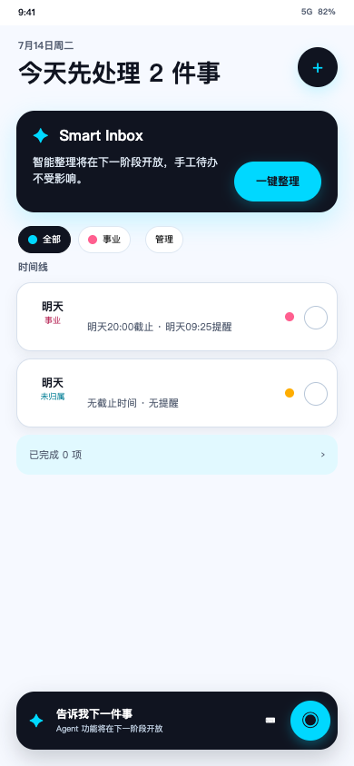

# H2 真实手工闭环审查包

## 门禁状态

- 日期：2026-07-16
- 分支：`codex/phase2-manual-loop`
- 实施范围：T10–T17 已实现
- 门禁：H2 已于 2026-07-17 人工明确通过
- 下一阶段：T18；H2 已通过，允许开始

本审查包只证明“没有 Agent 时，用户可以安全地完成认证、待办和项目的真实持久化闭环”。它不代表 P0 已发布，也不授权连接 DeepSeek、腾讯 ASR、真实用户数据或生产环境。

## 完成范围

| 任务 | 已实现结果                                                                | 主要自动化证据                                                          |
| ---- | ------------------------------------------------------------------------- | ----------------------------------------------------------------------- |
| T10  | 用户名注册/登录/退出、刷新恢复、30 天绝对 Session、注册初始积分原子 grant | `apps/server/test/auth.integration.test.ts`、`tests/e2e/phase2.spec.ts` |
| T11  | `GET /users/me` 只读资料、默认昵称“用户”、选填未验证手机号                | `packages/contracts/src/contracts.test.ts`、认证集成测试                |
| T12  | 隐藏式管理员改密、双版本递增、全 Session 撤销和脱敏审计                   | `apps/server/src/admin/password-set.test.ts`、认证集成测试              |
| T13  | 待办创建、详情、分页列表、当前筛选计数和真实项目摘要                      | `apps/server/test/manual-loop.integration.test.ts`、浏览器主路径        |
| T14  | 编辑、完成、已完成折叠、恢复和乐观锁                                      | 手工闭环集成测试、409 浏览器用例                                        |
| T15  | 软删除与服务端 3 秒单次 UndoOperation                                     | 数据库/服务端边界测试、3 秒内外浏览器用例                               |
| T16  | 项目创建、服务端配色、改名、归档、名称复用和真实筛选                      | 数据库并发测试、手工闭环集成测试、浏览器主路径                          |
| T17  | 三个时间字段选择/保存/清空/时区展示、分组和空状态                         | 客户端选择器/时间单测、服务端持久化测试、浏览器主路径                   |

正式产品使用真实 Taro 页面：Session 决定 Login/Register/Home，筛选使用 `projectId`，编辑使用 `taskId + version`，浏览器返回优先关闭当前 Sheet。H1 `?screen=` 仅保留在隔离的 Fixture Gallery。

## H2 首轮反馈修复

本轮只修改客户端 UI 与录入交互，不修改 API、数据库、Prisma、服务端或公开 Contract：

1. StatusBar 及登录/注册输入文字已在既定高度内垂直居中。
2. 最后一个项目与“管理项目”入口之间增加唯一的 1 × 20px 竖向分隔线。
3. 任务描述 Textarea 内层改为透明并填满外层，移除原生白框和缩放手柄。
4. 三个时间字段改为 Taro 年/月/日/时/分五列滚轮；支持 1970–2999、动态有效日期、1 分钟精度、取消不修改、确认后写入和独立显式清空。
5. TaskRow 只在真实禁用时传递 `disabled`，启用任务标题恢复 Ink 前景色和可见绘制区域。
6. 任务左侧计划时间/项目两行组合已相对任务行垂直居中。

时间选择仍使用用户时区本地值，提交时沿用既有转换写入 UTC；三个字段互相独立，不新增先后约束，也不触发提醒。Chrome H5 已完成定向与全量 E2E 验证；使用 Taro 标准 Picker 不代表微信小程序已经编译或实机通过。

## H2 项目栏与点击态反馈修复

本轮仍只修改客户端 UI，不修改 API、数据库、Prisma、服务端或公开 Contract：

1. 项目筛选栏保留原有 Flex 横向滚动，在 Chrome/Safari 与 Firefox 隐藏横向和纵向滚动条；触摸拖动、触控板和鼠标横向滚动仍可使用，内容可滚动到末端的“管理项目”入口。
2. 项目 Chip 禁止压缩和换行，标签最大显示宽度统一为 `6em`。6 个中文字符完整显示，超出时约显示前 5 个中文字符加 `…`；中英数字混排按实际显示宽度占位，不做 JavaScript 字符截断，DOM 文本和可访问名称始终保留完整项目名。
3. 在 `@ai-schedule/ui` 增加统一 `NeutralPressButton`，由组件固定 `hoverClass="none"`，正式页面、共享组件及 H1 Fixture 不再直接使用 Taro Button。
4. H5 按下态通过每个按钮自己的 CSS 变量复用静止态前景色和背景色，不以全局透明背景覆盖彩色控件；项目 Chip、顶部加号、Smart Inbox、任务主体/完成控件、表单 Picker 和 Sheet 按钮均不再出现 Taro 默认 `rgb(222, 222, 222)` 灰色块。
5. 项目持久选中、`aria-pressed`、真实禁用态和 2px Electric Ink 键盘焦点轮廓保持不变。`NeutralPressButton` 透传 ref，日期时间 Picker 关闭后仍可把焦点恢复到原触发按钮。

完整 E2E 首轮 16/17 暴露了包装组件未透传 ref、导致 Picker 焦点恢复断裂的问题；增加 `forwardRef` 和回归单测后，失败场景定向复验及最终全量 E2E 17/17 均通过，Visual 3/3 通过。

## 明确不在 H2

- Agent 对话、澄清、计划、提案确认和真实 Smart Inbox。
- DeepSeek 调用、pg-boss Agent Worker 和积分预留/结算。
- 语音采集、腾讯 ASR 和转写确认。
- `reminderAt` 到期触发、轮询、通知、Push 或已读状态。
- 昵称修改、C 端改密、找回密码、手机号验证码登录。
- 生产部署、公网开放、真实用户接入和真实 Provider Secret。

上述入口在 H2 正式页面展示“智能处理暂不可用”，不得执行 H1 Fixture 假流程。

## 本地复现

```bash
pnpm install
docker compose -f compose.yaml up -d postgres
cp .env.example .env
pnpm db:generate
pnpm db:migrate:deploy
pnpm dev
```

管理员改密演练见 [`../runbooks/admin-cli.md`](../runbooks/admin-cli.md)。自动浏览器路径使用隔离 Testcontainer，不读取或修改本地开发库：

```bash
pnpm test:e2e
```

Playwright 默认使用隔离端口：H5 `11086`、API `13000`；可分别通过 `H5_PORT`、`API_PORT` 覆盖，且不会复用已运行的开发服务。

## 人工验收路径

1. 打开注册页，使用用户名和密码注册；可分别验证留空手机号和选填手机号，并确认输入文字垂直居中。
2. 确认注册后 replace 进入待办首页；刷新页面仍保持 Session。
3. 点击顶部加号，确认打开手动新建待办而非 Agent；保存一个无项目待办。
4. 确认项目与“管理项目”之间只有一条竖向分隔线；进入项目管理，创建至少 8 个项目，并包含 6 个中文字符、7 个以上中文字符及中英数字混排项目名。
5. 在 320/390/480px 下确认项目栏高度稳定、没有可见横向或纵向滚动条，仍可左右滑动到末端并打开“管理项目”。6 个中文字符应完整显示，超长名称单行省略；在项目管理或辅助技术中仍可读取完整项目名。
6. 再创建高、中、低三个任务并分别归属项目；确认任务左侧项目名称/颜色与项目 Chip 同源，右侧优先级只有红、黄、绿且不受项目色影响。
7. 在项目 Chip、顶部加号、Smart Inbox、任务主体、完成控件、表单选择器和 Sheet 按钮上按住鼠标或手指，确认按下前、中、后背景色与文字色不变且不出现灰色块；切换项目时只有合法选中态改变。
8. 使用键盘 Tab 确认交互控件仍显示 2px Electric Ink 焦点轮廓；打开后取消或确认时间 Picker，确认焦点回到触发字段且父级任务 Sheet 不被误关。
9. 在“全部”和真实项目 Chip 间切换；确认无项目任务只出现在“全部”，数量和空状态随当前范围变化。
10. 编辑任务标题、描述、项目和优先级；确认描述区没有内层白框或缩放手柄，保存后内容可持久化。
11. 分别打开计划时间、截止时间和提醒时间滚轮，验证取消不改值、确认后精确回填、闰年/月末有效日期、00:00/23:59 及独立清空。
12. 确认待办标题可见，左侧计划时间/项目组合相对任务行垂直居中；同时验证无项目、长项目名和已完成任务。
13. 完成任务，展开已完成区并长期恢复；确认完成/恢复没有 3 秒撤销 Toast。
14. 删除任务，在 3 秒内撤销；再次删除并等待超过 3 秒，确认服务端拒绝撤销。
15. 改名项目；验证活跃项目重名冲突保留输入；归档后 Chip 消失、任务仍显示原项目摘要，并可复用原项目名。
16. 打开任一 Sheet 后使用浏览器返回；确认只关闭 Sheet，原项目筛选仍保留。
17. 退出登录，确认个人任务和本地筛选/Sheet/Undo 状态立即清空；重新登录后数据仍持久化。
18. 按管理员 Runbook 修改密码，确认旧密码与全部旧 Session 失效，新密码可登录。
19. 点击 Smart Inbox、底部 Agent/语音入口，确认只显示“智能处理暂不可用”，没有模型、ASR 或积分调用。

验收中遇到 409 或网络失败时，任务/项目表单内容必须保留，不得展示虚假成功。

## 截图

以下截图来自正式 H2 路径，不是 H1 Fixture：

- [320 × 844](screenshots/h2-manual-loop-320x844.png)
- [390 × 844](screenshots/h2-manual-loop-390x844.png)
- [480 × 844](screenshots/h2-manual-loop-480x844.png)
- [登录 390 × 844](screenshots/h2-login-390x844.png)
- [任务编辑 390 × 844](screenshots/h2-task-form-390x844.png)
- [日期时间 Picker 390 × 844](screenshots/h2-datetime-picker-390x844.png)
- [项目栏滚动后 390 × 844](screenshots/h2-project-strip-scrolled-390x844.png)



## 自动化结果

| 命令/范围                            | 当前记录                                                                             |
| ------------------------------------ | ------------------------------------------------------------------------------------ |
| PostgreSQL 数据库集成                | 11/11 通过：租户约束、配色并发、归档竞态、排序、软删除与 3 秒边界                    |
| 服务端集成                           | 14/14 通过：认证/并发注册/改密/Session、Task/Project/Undo、幂等事务                  |
| `pnpm test`                          | 96/96 通过；其中 UI 9/9，含 NeutralPressButton ref/hoverClass、Picker 与 H5 代理回归 |
| `pnpm typecheck`                     | 11/11 Workspace 任务通过                                                             |
| `pnpm lint`                          | 7/7 Workspace 包及根 E2E/Playwright Lint 通过                                        |
| `pnpm build`                         | 7/7 Workspace 任务通过；H5 811 modules，约 9.38s                                     |
| `pnpm test:integration`              | 数据库 11/11、服务端 14/14 通过                                                      |
| `pnpm test:e2e` / `pnpm test:visual` | 17/17 与 3/3 通过；含隐藏滚动条横滑、名称省略、按压静止色、Picker 焦点和三视口       |
| `pnpm format:check`                  | 通过                                                                                 |

## 提交与关键变更

- 分支：`codex/phase2-manual-loop`
- Phase 2 认证基础提交：`d60dce9 feat: 建立认证安全基础能力`
- T10–T17 实现提交：`f6dec8e`、`55e9e62`、`2dd3673`、`9b9f622`
- H2 首轮 UI 修复：运行 `git log --oneline -- apps/client/src/components/date-time-picker-field.tsx packages/ui/src/electric-ink.tsx` 查询两个可独立回滚提交
- H2 项目栏滚动与名称展示：`127cba3 fix: 优化项目栏滚动与名称展示`
- H2 Taro 默认灰色按压态修复与本轮文档：本次提交（完成后运行 `git log -1 -- packages/ui/src/neutral-press-button.tsx` 查询）
- H2 文档与验收提交：运行 `git log -1 -- docs/quality/h2-manual-loop-review.md` 查询本审查包所在提交

本轮客户端变更集中在 `apps/client/src/components/`、`packages/ui/src/neutral-press-button.tsx`、`packages/ui/src/electric-ink.scss`、`tests/e2e/h2-project-strip.spec.ts` 与 `tests/e2e/h2-press-state.spec.ts`。T10–T17 的服务端/数据库实现未在本轮修改。

## 追踪与已知风险

完整 PRD/行为到测试映射见 [`acceptance-traceability.md`](acceptance-traceability.md)。

- H2 浏览器自动化使用 Chrome 和 320/390/480px 视口；日期时间 Picker 只完成 Chrome H5 验证，微信小程序编译/实机以及 iOS/Android 真机 IME、安全区和地址栏仍在 T25/T27 验证。
- 三个 Picker 当前会同时挂载 1970–2999 年选项，Chrome H5 验证正常，但低端移动设备上约 3471 个隐藏选项节点的首次渲染成本尚未量化；在 T27 真机矩阵中复验，若有问题再改为按需挂载。
- Picker 关闭后使用 400ms 延迟恢复焦点；正常取消、确认、清空和父级 Sheet 路径均已通过 E2E，极快连续切换不同 Picker 的焦点竞争留待 T27 真机复验。
- `NeutralPressButton` 使用 Taro 标准 `hoverClass="none"` 并透传 ref；当前只在 Chrome H5 验证了 pointerdown 颜色与焦点恢复，微信小程序编译和真机按压反馈仍归入 T27 跨端矩阵。
- 图标归一与少量 Figma 视觉细节按已批准结论延期到 T27，不阻断手工业务闭环判断。
- 当前认证限流是有容量上限的单进程内存实现；多副本生产部署前必须在 T28/T29 迁移到网关或共享存储。
- 列表项与范围计数当前使用 PostgreSQL `READ COMMITTED` 的连续查询；并发写入瞬间可能出现一次计数/列表短暂不一致，后续可收敛为同一快照或单条 CTE。
- 列表游标尚未显式验证属于当前用户和筛选范围；UUID 不可枚举且查询不会返回他人数据，但 T28 前应补齐范围校验以消除排序锚点和存在性侧信道。
- 首次向含历史数据的环境部署前，需要预检同一用户的重复 Contact；H2 没有生产迁移授权。
- Taro/Rspack 在受限 macOS 沙箱内读取 system-configuration `dynamic_store` 时会出现 NULL panic 并挂起；同一 Node.js 24 全量构建命令在受控沙箱外成功（H5 811 modules，约 9.38s），因此当前判定为环境限制，而不是代码构建失败。复验命令：`mise exec -- corepack pnpm build`。
- Agent/ASR/提醒触发尚未实现，因此不能把 H2 结果外推为完整 P0 或发布批准。

## 需要人类给出的结论

无新增产品待决策项。请按上述路径给出其一：

- `通过`：H2 标记完成，才允许开始 T18。
- 修改清单：保持 H2 未通过，仅修正清单内问题并重新提交审查。

最终结论：`通过`。Phase 3 仅实施 T18–T24；语音、T25–T27 和生产工作仍不在本阶段授权范围内。
