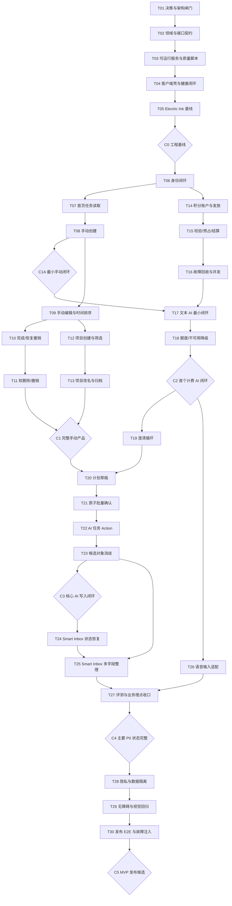

# AI 待办管理产品 MVP 实施计划（历史拆分参考）

> 状态：已于 2026-07-13 被 H0 批准后的 `tasks/plan.md` 取代。本文保留早期任务分析与验收细节，不再作为任务状态或未决产品决策的真源。文中旧任务编号与当前 T10–T17 不同；“所有手工操作可撤销”“P0 交付站内提醒”等旧口径已由 PRD v1.4 与 ADR-008 覆盖，不得据此实施。当前事实是 canonical T10–T17 已实现、H2 待人工审查，见 `tasks/current.md`。

## 0. 文档信息

| 项目       | 内容                                                                                                                                                                               |
| ---------- | ---------------------------------------------------------------------------------------------------------------------------------------------------------------------------------- |
| 计划状态   | 已被 `tasks/plan.md` 取代；canonical T10–T17 已实现、H2 待人工审查                                                                                                                 |
| 编制日期   | 2026-07-13                                                                                                                                                                         |
| 产品真源   | 本文编制时基于 v1.2；当前真源为 `product_doc/prd.md` v1.4                                                                                                                          |
| UI 真源    | Figma `05 Electric Ink UI / Production V3`，页面节点 `210:2`                                                                                                                       |
| Figma 链接 | <https://www.figma.com/design/dryFtYbit291732gktHIqZ/AI-%E9%A1%B9%E7%9B%AE%E5%BE%85%E5%8A%9E-P0-%E9%AB%98%E4%BF%9D%E7%9C%9F-UI-%E8%A7%86%E8%A7%89%E6%96%B9%E6%A1%88?node-id=210-2> |
| 交付目标   | 把 P0 拆成可独立实现、测试和验收的薄纵向切片                                                                                                                                       |
| 本文不做   | 不选择未经确认的最终技术栈，不编写业务代码，不实施 P1/P2                                                                                                                           |

---

## 1. 目标与交付策略

MVP 的最小价值闭环是：

```text
用户主动输入模糊目标
  -> AI 澄清或给出候选
  -> 生成可编辑计划/Action 草稿
  -> 用户明确确认
  -> 原子写入项目与待办
  -> 用户后续查看、编辑、完成、恢复或删除
```

实施顺序遵循以下原则：

1. 先解决会阻塞代码结构的产品与技术决策，再建立始终可运行的工程骨架。
2. 先交付手动待办最小闭环，确保 AI、ASR 或积分服务不可用时产品仍可使用。
3. 在第一次模型调用前完成积分校验、预占和结算底座，避免后补计费造成返工。
4. AI 功能按“文字回复 -> 澄清 -> 计划草稿 -> 批量确认 -> AI 管理任务”逐步纵向扩展。
5. 每 3 至 5 个任务设置可运行检查点；检查点失败时不进入下一阶段。
6. 真实模型不作为 CI 的稳定性前提；CI 使用固定响应的模型/ASR 测试替身，真实服务只做受控冒烟测试。

---

## 2. 资料真源与冲突规则

发生冲突时按以下优先级判断：

1. `product_doc/prd.md` v1.2：业务范围、数据语义、积分规则和验收标准的最终真源。
2. Figma `05 Electric Ink UI / Production V3`：P0 页面状态、布局和视觉呈现真源。
3. `design/ComponentsDesign.md` 与 `design/AI_Project_Todo_P0_HiFi_V2_ElectricInk_Tokens.json`：通用组件和视觉 token 参考。
4. `design/AI_Project_Todo_P0_LowFi_Clickable_Prototype.html`：交互意图参考，不作为数据或安全规则真源。
5. 其他旧版设计日志：仅用于追溯，不得覆盖 PRD v1.2 或 Production V3。

已知冲突的处理方式：

- 设计稿中的 Type 1 至 Type 4 只是设计标注；代码和接口统一使用 `user_input`、`ai_reply`、`question`、`action_confirm`。
- 旧设计资料中的项目健康度、积分余额、升级/充值和完整项目工作台均不进入 P0。
- 最终额度页不得展示积分、Token、成本或充值入口。
- `TaskRow`、Sheet 圆角等旧文档存在双轨值；实施前必须从 Production V3 固化最终 token 并建立截图基线。
- `scheduled_at` 已进入 P0 数据模型，但手动编辑入口仍受 OD-05 决策约束，不得擅自增加交互。

---

## 3. 当前仓库事实与计划约束

当前仓库只有产品和设计资料，没有应用工程：

- 无 `package.json`、锁文件、源码目录、数据库迁移或 CI。
- 无已确定的客户端、服务端、数据库、身份、模型、ASR 或提醒技术方案。
- 无可执行的 `dev`、`build`、`lint`、单元测试、集成测试或 E2E 命令。
- Git 尚无受控实现基线，现有资料均未跟踪。

因此，T01 是实施硬闸门。T01 完成前，本文中的代码路径均为建议的语义路径，不代表现有文件。

### 3.1 建议路径别名

T01 必须把以下别名替换为最终目录，并回填到技术架构文档：

| 别名              | 建议目录             | 责任                                 |
| ----------------- | -------------------- | ------------------------------------ |
| `<CLIENT_ROOT>`   | `apps/client`        | 移动端或移动优先客户端               |
| `<API_ROOT>`      | `apps/api`           | 鉴权、任务、项目、AI、积分和审计 API |
| `<CONTRACT_ROOT>` | `packages/contracts` | DTO、枚举、错误码、Action Schema     |
| `<DB_ROOT>`       | `packages/db`        | 物理模型、迁移、事务和数据访问       |
| `<UI_ROOT>`       | `packages/ui`        | Electric Ink token 与共享组件        |
| `<TESTKIT_ROOT>`  | `packages/testkit`   | 固定模型/ASR 响应、工厂和故障注入    |
| `<E2E_ROOT>`      | `tests/e2e`          | 跨端用户动线和视觉回归               |
| `<OPS_ROOT>`      | `ops`                | 环境、CI、部署和运行手册             |
| `<DOC_ROOT>`      | `product_doc`        | 架构、接口、数据与测试规格           |

### 3.2 验证命令契约

T03 必须产出并在 CI 中执行下列稳定脚本名。具体包管理器和底层命令由 T01 决定：

```text
dev                 启动本地客户端、API 和依赖服务
build               构建全部可发布产物
lint                静态规范检查
typecheck           类型或编译期检查
test                单元测试
test:integration    API、数据库、事务和外部适配器契约测试
test:e2e            核心用户动线测试
test:visual         390 x 844 等基准视口截图回归
```

本文任务中的“运行标准验证”指：受影响范围的单元/集成测试通过，且根级 `lint`、`typecheck`、`build` 不回归。

### 3.3 单任务完成定义

每个任务只有同时满足以下条件才可标记完成：

- 输入契约、输出契约和数据库变化已同步。
- 自动化测试覆盖成功、失败、鉴权和幂等边界中与本任务相关的部分。
- 客户端状态覆盖加载、空、成功和失败，不用假成功掩盖服务端错误。
- 新增持久化对象包含 `extra: Object`，默认 `{}`；核心字段不得塞入 `extra`。
- 自 T17 起，每个新增 AI/Action 分支都必须写入最小审计事件并提供契约测试，不得留到最终埋点任务补录。
- 不引入 P1/P2，不实现首次使用引导。
- 运行标准验证通过，并保留可复现的人工验收步骤或截图。
- 单任务优先控制在 3 至 5 个文件组；超出时继续拆分，不以“大任务先占位”代替拆解。

### 3.4 AI 积分实施不变量

- 用户在发送前取消输入，或某条路径完全不调用 AI/模型 API：不进入积分网关，不扣分。
- 收费 AI 请求必须先原子校验并预占；可用结果成功持久化后按 `request_id` 幂等结算一次。
- 只有对应 debit 已成功结算，客户端才可收到可消费的 AI 结果；结算暂时失败时复用已持久化结果重试，不得再次调用模型。
- 可用 AI 结果已经结算后，用户关闭浮层、取消 Action、拒绝创建任务或删除草稿项：业务数据不写入或按用户选择调整，但本次积分不退。
- 系统或模型失败且没有形成可用结果：释放预占，不扣分；异常错扣只通过唯一、等额的 refund 流水补偿。
- Action 确认/取消、草稿本地编辑、数据库写入和撤销若不再调用模型：不产生第二次扣分。

---

## 4. 实施前决策闸门

| 决策                                 | 最晚完成任务     | 未决时的影响                                       |
| ------------------------------------ | ---------------- | -------------------------------------------------- |
| OD-02 产品平台与客户端形态           | T01              | 无法确定客户端框架、路由、E2E 与发布方式           |
| OD-03 登录方式                       | T01              | 阻塞 T06 的身份模型和安全边界                      |
| OD-04 提醒交付通道                   | T01，最晚 T09 前 | 阻塞提醒权限、调度和验收方式                       |
| OD-05 `scheduled_at` 手动入口        | T01，最晚 T09 前 | 阻塞任务编辑 UI 和可用性验收                       |
| OD-06 撤销时限                       | T01，最晚 T10 前 | 阻塞 UndoOperation 过期规则                        |
| OD-07 初始赠送量、每日额度、能力成本 | T01，最晚 T14 前 | 阻塞积分种子和额度测试                             |
| OD-08 上线指标阈值                   | T27 前           | 阻塞监控告警和发布评审                             |
| OD-09 同名项目规则                   | T01，最晚 T12 前 | 阻塞项目唯一约束和错误提示                         |
| OD-10 完整会话历史入口               | 不阻塞 P0        | P0 只保存恢复澄清/确认所需上下文，不实现完整历史页 |

PRD 当前状态为“待评审”。T01 检查点必须由产品、客户端、服务端、Agent、QA 和安全负责人共同确认后，才能开始 T03 之后的实现。

---

## 5. 依赖图



---

## 6. 分阶段任务

## Phase 0：决策、契约与可运行骨架

### T01：冻结平台、架构和实施路径

**目标**：把会改变代码结构的待决策项转成明确 ADR，并建立真实路径和命令注册表。

**输入**：PRD OD-02 至 OD-09、Figma 390 x 844 目标、当前空仓库事实。

**输出**：技术架构、ADR、最终目录映射、运行时/包管理器版本和决策记录。

**验收标准**：

- [ ] OD-02/03/04/05/06/07/09 均有负责人、结论和变更影响，未决项不得伪装成默认实现。
- [ ] `<CLIENT_ROOT>` 等路径别名与 `dev/build/test` 命令被替换为真实值。
- [ ] 产品、工程和 QA 明确批准“首次使用引导为 P1，MVP 不实施”。

**依赖**：无。

**涉及目录和文件**：

- `<DOC_ROOT>/technical-architecture.md`
- `<DOC_ROOT>/architecture-decisions.md`
- `<DOC_ROOT>/test-strategy.md`
- 根目录运行时版本文件与 `AGENTS.md`

**验证**：文档评审；路径和命令不存在占位符；PRD 发布前置决策表有对应结论。

**规模**：M，4 个文件组。

### T02：冻结领域模型、API 和 Agent 契约

**目标**：在业务实现前锁定跨模块边界，防止客户端、API、数据库和 Agent 各自解释 PRD。

**输入**：PRD 12 个持久化对象、四类语义消息、Action 状态机、积分请求/预占/流水规则。

**输出**：物理模型草案、HTTP/RPC 契约、错误码、Action Schema、幂等键和固定测试样例。

**验收标准**：

- [ ] 所有对象字段、枚举、用户归属、`extra`、唯一约束和状态迁移可机器校验。
- [ ] API 明确认证、分页/排序、版本冲突、幂等、错误映射和事务边界。
- [ ] Agent 固定样例至少覆盖 AI 回复、澄清、计划草稿、Action 草稿和候选对象。

**依赖**：T01。

**涉及目录和文件**：

- `<DOC_ROOT>/database-schema.md`
- `<DOC_ROOT>/api-contract.md`
- `<DOC_ROOT>/agent-action-schema.md`
- `<CONTRACT_ROOT>/domain/*`
- `<TESTKIT_ROOT>/fixtures/agent/*`

**验证**：契约 schema 校验通过；固定样例能被解析；无 Type 1 至 Type 4 业务枚举。

**规模**：M，5 个文件组。

### T03：建立服务端、数据库和质量脚本的可运行脊柱

**目标**：让空仓库第一次具备可重复启动、迁移、构建和测试的能力。

**输入**：T01 技术选型、T02 契约和路径映射。

**输出**：工作区、API 健康接口、数据库空迁移、测试 runner、根级验证脚本和 CI 骨架。

**验收标准**：

- [ ] 新环境按 `AGENTS.md` 与本地开发 Runbook 一次安装后能启动依赖、执行迁移并访问健康接口。
- [ ] `lint/typecheck/test/test:integration/build` 均有实际测试且成功，不能是空脚本。
- [ ] CI 在干净环境执行同一组命令，失败会阻止合并。

**依赖**：T02。

**涉及目录和文件**：

- 根目录工作区清单、锁文件与脚本
- `<API_ROOT>/src/health/*`
- `<DB_ROOT>/migrations/*`
- `<TESTKIT_ROOT>/setup/*`
- `<OPS_ROOT>/ci/*`

**验证**：运行全部根级质量脚本；删除本地产物后重新安装和迁移；CI 冒烟通过。

**规模**：M，5 个文件组。

### T04：建立客户端壳与 API 健康闭环

**目标**：交付第一个真正跨客户端和 API 的薄切片，为后续 UI 和 E2E 提供稳定载体。

**输入**：T03 健康接口、T01 客户端平台决策。

**输出**：客户端启动页、路由壳、API client、环境配置和一条端到端健康测试。

**验收标准**：

- [ ] 客户端在目标模拟器/浏览器启动并展示明确的服务连接状态。
- [ ] API 不可用时显示真实失败状态，不伪装成已连接。
- [ ] `test:e2e` 能从客户端启动一直验证到 API 健康响应。

**依赖**：T03。

**涉及目录和文件**：

- `<CLIENT_ROOT>/src/app/*`
- `<CLIENT_ROOT>/src/lib/api-client.*`
- `<CLIENT_ROOT>/src/config/*`
- `<E2E_ROOT>/health.*`
- `<OPS_ROOT>/env/*`

**验证**：客户端/API 联合启动；健康 E2E；断开 API 后的失败态人工检查。

**规模**：M，5 个文件组。

### T05：固化 Electric Ink token、基础组件和视觉基线

**目标**：把 Production V3 的视觉规则转为可复用 token 和最小组件，避免后续页面各自硬编码。

**输入**：Figma Production V3、`ComponentsDesign.md`、Electric Ink token JSON。

**输出**：颜色、排版、间距、圆角、阴影 token；Button、Input、Sheet、TaskRow 壳；390 x 844 截图基线。

**验收标准**：

- [ ] 固化 `#F6F9FF`、`#FFFFFF`、`#101420`、`#00D8FF`、Noto Sans SC 和字距 0。
- [ ] 解决 TaskRow/Sheet 圆角冲突并记录选择来源；主操作为青底深字，项目色只作身份标识。
- [ ] 基础组件截图在 390 x 844 无裁切，交互命中区不少于 44 x 44。

**依赖**：T04。

**涉及目录和文件**：

- `<UI_ROOT>/tokens/*`
- `<UI_ROOT>/components/Button*`
- `<UI_ROOT>/components/Sheet*`
- `<UI_ROOT>/components/TaskRow*`
- `<E2E_ROOT>/visual/foundations.*`

**验证**：token 快照测试；组件单测；`test:visual` 基线通过；与 Figma 截图人工比对。

**规模**：M，5 个文件组。

### Checkpoint C0：工程可持续运行

- [ ] 所有根级质量脚本和 CI 可用。
- [ ] 客户端能连接 API，断网状态可观察。
- [ ] Electric Ink 基础组件有视觉基线。
- [ ] T01/T02 已完成人工批准，之后才允许功能实现。

---

## Phase 1：身份与手动待办闭环

### T06：注册、登录、退出和受保护首页

**目标**：完成身份最小闭环，并确保登录稿中的任务只是静态演示。

**输入**：T02 身份契约、Figma Login、OD-03 结论。

**输出**：User 迁移、注册/登录/退出 API、认证客户端页面、受保护空首页。

**验收标准**：

- [ ] 未登录页面不查询真实任务；静态演示不可操作，认证后只显示当前用户数据。
- [ ] 注册、登录、退出和会话恢复可用，跨用户 token 不能访问彼此数据。
- [ ] 第一次和再次登录都直接进入首页，不自动打开 AI 对话或播放首次引导。

**依赖**：Checkpoint C0。

**涉及目录和文件**：

- `<DB_ROOT>/schema/user*` 与对应迁移
- `<CONTRACT_ROOT>/auth/*`
- `<API_ROOT>/src/modules/auth/*`
- `<CLIENT_ROOT>/src/features/auth/*`
- `<E2E_ROOT>/auth.*`

**验证**：身份单元/集成测试；注册到退出 E2E；未认证网络请求审计。

**规模**：M，5 个文件组。对应 AC-09、AC-13、AC-25。

### T07：首页任务读取、真实计数和空状态

**目标**：让已登录用户看到真实、持久的任务首页，即使当前没有任务。

**输入**：Task 最小读取契约、Figma All Todos 与 Empty State。

**输出**：Task 基础表、列表 API、首页标题/日期/计数、TaskRow 列表与空状态。

**验收标准**：

- [ ] 首页 N 等于当前范围 pending 数；无任务时显示“今天已经清空”。
- [ ] 空状态仍保留项目栏位置、Smart Inbox 入口、已完成区位置和底部 composer。
- [ ] T17/T24 合入前，AI 控件受 feature flag 控制并呈现明确禁用状态或不暴露操作；不得出现无响应按钮或静默模型调用。
- [ ] 查询只返回当前用户未删除任务，并以服务端确定性顺序返回。

**依赖**：T06、T05。

**涉及目录和文件**：

- `<DB_ROOT>/schema/task*` 与对应迁移
- `<CONTRACT_ROOT>/tasks/read*`
- `<API_ROOT>/src/modules/tasks/list*`
- `<CLIENT_ROOT>/src/features/tasks/TaskHome*`
- `<E2E_ROOT>/tasks-empty-list.*`

**验证**：列表隔离集成测试；空/非空 UI 测试；390 x 844 截图回归。

**规模**：M，5 个文件组。对应 AC-20。

### T08：手动创建待办

**目标**：形成第一条完整业务纵向切片“加号 -> Task Edit Sheet -> 保存 -> 首页刷新”。

**输入**：T07 首页、Task 创建契约、Figma Task Edit。

**输出**：创建 API、字段校验、最小 UndoOperation、手动新建 Sheet、保存/失败反馈和撤销 Toast。

**验收标准**：

- [ ] 顶部加号只打开手动创建，不调用 Agent 或积分接口。
- [ ] 标题必填；保存成功后任务出现在列表，刷新和重新登录后仍存在。
- [ ] 手动创建成功后生成 `source_type=manual` 的撤销记录；时限内撤销幂等恢复创建前状态且不物理删除审计记录。
- [ ] 保存失败时保留用户输入并展示真实错误，不生成半条任务。

**依赖**：T07。

**涉及目录和文件**：

- `<CONTRACT_ROOT>/tasks/create-undo*`
- `<DB_ROOT>/schema/undo-operation*` 与对应迁移
- `<API_ROOT>/src/modules/tasks/create-undo*`
- `<CLIENT_ROOT>/src/features/tasks/{TaskEditSheet,UndoToast}*`
- `<E2E_ROOT>/task-create.*`

**验证**：字段校验、创建与撤销幂等集成测试；创建/撤销/刷新/重登 E2E；断言无积分调用。

**规模**：M，5 个文件组。对应 AC-06、AC-17、AC-22。

### Checkpoint C1A：认证、列表与手动创建最小闭环

- [ ] 用户可注册/登录，看到真实空首页，创建一项任务并在刷新或重登后继续看到它。
- [ ] 手动创建可撤销且不调用 Agent、模型或积分接口。
- [ ] 尚未启用的 AI 控件没有死按钮、静默调用或伪成功状态。
- [ ] 该检查点通过后，T17 才允许接入第一次真实模型调用。

### T09：手动编辑时间字段与确定性排序

**目标**：支持标题、描述、优先级、`scheduled_at`、截止和提醒的编辑与展示；项目归属在 T12 接入。

**输入**：OD-04/05 结论、T08 Sheet、Task 完整字段契约。

**输出**：更新 API、版本校验、时间/提醒编辑控件、时间线排序、显示规则和 OD-04 对应的提醒交付适配。

**验收标准**：

- [ ] `scheduled_at`、deadline、reminder 分别存储和展示，不互相代替。
- [ ] 过期排期优先，其后 scheduled_at 升序、未排期最后；并列按优先级和创建时间稳定排序。
- [ ] 旧版本更新被拒绝且不覆盖新数据；失败时编辑内容仍保留。
- [ ] `scheduled_at` 手动入口遵循 OD-05；`reminder_at` 变化按 OD-04 完成调度、改期和取消，若 P0 仅保存字段则必须先同步更新 PRD 与验收口径。

**依赖**：T08；OD-04/05 必须完成。

**涉及目录和文件**：

- `<CONTRACT_ROOT>/tasks/update*`
- `<DB_ROOT>/queries/task-ordering*`
- `<API_ROOT>/src/modules/tasks/update-reminder*`
- `<CLIENT_ROOT>/src/features/tasks/{TaskEditSheet,reminder-adapter}*`
- `<E2E_ROOT>/task-edit-ordering.*`

**验证**：排序属性测试；版本冲突、时区、提醒权限、调度/改期/取消契约测试；按 OD-04 在目标真机验证；长中文和失败态视觉检查。

**规模**：M，5 个文件组。对应 AC-06、AC-10、AC-20。

### T10：完成、恢复、已完成折叠与撤销

**目标**：在 T08 撤销底座上交付完成、恢复及 Figma Done Expanded/Toast Undo 的完整可逆状态切片。

**输入**：T08 UndoOperation、T09 任务状态、OD-06 撤销时限、Figma Done Expanded/Toast Undo。

**输出**：状态 API、完成/恢复撤销扩展、完成折叠区、恢复操作和可撤销 Toast。

**验收标准**：

- [ ] 完成任务立即移入当前范围的已完成折叠区，恢复后回到待完成区。
- [ ] 完成和恢复成功后均生成 `source_type=manual` 的 UndoOperation，并展示可撤销反馈。
- [ ] 重复撤销只成功一次，版本冲突不覆盖后续修改；完成取消提醒，恢复或撤销完成时按 OD-04 重新调度有效提醒。
- [ ] Toast 消失后仍可展开已完成区恢复任务。

**依赖**：T09；OD-06 必须完成。

**涉及目录和文件**：

- `<DB_ROOT>/schema/undo-operation*` 扩展与迁移
- `<CONTRACT_ROOT>/tasks/status-undo*`
- `<API_ROOT>/src/modules/tasks/status-undo*`
- `<CLIENT_ROOT>/src/features/tasks/CompletedFold*`
- `<E2E_ROOT>/task-complete-undo.*`

**验证**：创建/完成/恢复撤销的幂等、过期和冲突测试；Toast 撤销与折叠恢复 E2E；零积分调用断言。

**规模**：M，5 个文件组。对应 AC-06、AC-22。

### T11：软删除与撤销

**目标**：让删除从活动列表移除但保留可恢复数据和审计链路。

**输入**：T10 UndoOperation、Task Edit 删除入口。

**输出**：软删除 API、删除确认/反馈、撤销和默认查询过滤。

**验收标准**：

- [ ] 删除只设置 deleted 状态/时间，不物理删除任务。
- [ ] 软删除可在时限内撤销，重复请求幂等，活动列表默认不返回 deleted；删除取消提醒，撤销时按 OD-04 重新调度。
- [ ] 删除和撤销都不调用模型或改变 AI 积分。

**依赖**：T10。

**涉及目录和文件**：

- `<CONTRACT_ROOT>/tasks/delete*`
- `<API_ROOT>/src/modules/tasks/soft-delete*`
- `<DB_ROOT>/queries/active-tasks*`
- `<CLIENT_ROOT>/src/features/tasks/TaskEditSheet*`
- `<E2E_ROOT>/task-delete-undo.*`

**验证**：软删除/撤销集成测试；列表过滤测试；UI E2E；积分流水不变断言。

**规模**：M，5 个文件组。对应 AC-06、AC-17、AC-22。

### T12：项目创建、筛选和管理入口

**目标**：交付“全部/项目 Chip -> 项目范围”的轻量分组闭环。

**输入**：T08 任务、OD-09 结论、Figma Work Project/Project Management。

**输出**：Project 表、创建/列表 API、任务项目归属更新、项目 Chip、末端管理入口和项目筛选。

**验收标准**：

- [ ] 普通 Chip 只筛选；末端独立“管理项目”按钮打开 Bottom Sheet；顶部加号仍只新建任务。
- [ ] 无项目任务只在“全部”出现；项目 N 只统计 pending。
- [ ] 用户可在任务创建/编辑浮层选择活跃项目或“无项目”，保存后当前范围和计数同步刷新。
- [ ] 项目身份色自动分配但不表达优先级，名称约束遵循 OD-09。

**依赖**：T09、T05；OD-09 必须完成。

**涉及目录和文件**：

- `<DB_ROOT>/schema/project*` 与对应迁移
- `<CONTRACT_ROOT>/projects/create-list*`
- `<API_ROOT>/src/modules/projects/create-list*`
- `<CLIENT_ROOT>/src/features/{projects/ProjectFilter,tasks/ProjectEditField}*`
- `<E2E_ROOT>/project-create-filter.*`

**验证**：项目隔离/计数测试；筛选 E2E；管理入口可达性测试。

**规模**：M，5 个文件组。对应 AC-07、AC-24。

### T13：项目改名、归档与任务保留

**目标**：完成 Project Management Sheet 的 P0 操作，但不加入恢复归档项目。

**输入**：T12 项目、归档业务规则、Figma Project Management。

**输出**：改名/归档 API、轻量项目摘要、归档确认、Chip 更新和任务保留查询。

**验收标准**：

- [ ] 归档入口、可访问名称、确认标题和文案均使用“归档”，不使用“删除”。
- [ ] 归档后项目从 Chip 消失，但所属任务继续在“全部”中显示并保留项目信息。
- [ ] 项目范围展示名称、pending 数和“已完成数 / 未删除任务总数”进度；摘要卡的末端入口进入归档确认。
- [ ] P0 没有恢复归档项目入口，也不级联删除或解除任务。

**依赖**：T12。

**涉及目录和文件**：

- `<CONTRACT_ROOT>/projects/update-archive*`
- `<API_ROOT>/src/modules/projects/update-archive*`
- `<DB_ROOT>/queries/project-archive*`
- `<CLIENT_ROOT>/src/features/projects/{ProjectManagementSheet,ProjectSummaryRow}*`
- `<E2E_ROOT>/project-archive.*`

**验证**：归档数据完整性集成测试；全部/项目筛选 E2E；归档文案视觉检查。

**规模**：M，5 个文件组。对应 AC-07、AC-24。

### Checkpoint C1：完整手动待办产品

- [ ] 用户可注册、登录、退出并只访问自己的数据。
- [ ] 可创建、查看、编辑、完成、恢复、软删除和撤销任务。
- [ ] 计划时间、Deadline、提醒分别显示；OD-04 选定的提醒交付及降级行为通过验收。
- [ ] 项目创建、筛选、改名、轻量摘要和归档可用。
- [ ] AI、ASR、积分服务全部关闭时，上述能力仍通过 E2E。

---

## Phase 2：积分底座与第一次 AI 调用

### T14：AI 积分账户、初始 grant 与每日补足

**目标**：在调用模型前建立可核对的账户和发放生命周期。

**输入**：OD-07 参数、User、AiCapability/AiPointTransaction 契约。

**输出**：积分字段、能力配置、流水表、注册初始 grant、按用户时区每日补足和对账测试。

**验收标准**：

- [ ] 新账号从 0 开始，以唯一 `new_user_initial_grant` 流水原子增加余额。
- [ ] 注册次日起，每个用户本地日期最多一笔 `daily_allowance_top_up`，流水保存 `grant_period_date` 与 `grant_rule_version`，高于目标不扣减。
- [ ] `User.ai_points` 等于 succeeded 流水之和；用户侧不展示余额、成本或流水。
- [ ] 调模型的有效能力成本大于 0，非模型能力成本为 0；能力、接口、成本规则版本组合唯一且同一时刻最多一个生效版本。

**依赖**：T06；OD-07 必须完成。

**涉及目录和文件**：

- `<DB_ROOT>/schema/ai-points*` 与对应迁移
- `<CONTRACT_ROOT>/ai-points/account*`
- `<API_ROOT>/src/modules/ai-points/grants*`
- `<TESTKIT_ROOT>/factories/ai-points*`
- `<API_ROOT>/test/ai-points-grants*`

**验证**：注册重放、跨时区、重复补足和原子失败集成测试；能力成本/版本约束测试；账实核对测试。

**规模**：M，5 个文件组。对应 AC-18、AC-21、AC-26。

### T15：积分校验、原子预占和成功结算

**目标**：交付所有收费模型接口必须经过的独立积分网关 happy path。

**输入**：T14 账户、能力成本、request_id/reservation_id 契约。

**输出**：校验/预占接口、有效预占、成功结算和幂等重放。

**验收标准**：

- [ ] 校验与预占是原子操作；同一 request_id 重试复用 reservation_id。
- [ ] 只有持有效预占才能调用收费模型；可用结果持久化后原子扣余额并写含能力/接口/成本规则快照的 succeeded debit。
- [ ] 只有结算成功才向客户端返回可消费结果；结算暂时失败时保留预占并复用已持久化结果重试，不重复调用模型。
- [ ] 不调用模型的手动或确定性路径不进入积分接口、不产生流水。

**依赖**：T14。

**涉及目录和文件**：

- `<CONTRACT_ROOT>/ai-points/gateway*`
- `<API_ROOT>/src/modules/ai-points/reserve*`
- `<API_ROOT>/src/modules/ai-points/settle*`
- `<DB_ROOT>/transactions/ai-points*`
- `<API_ROOT>/test/ai-points-happy-path*`

**验证**：余额边界、重复请求和结果结算集成测试；确定性路径零流水测试。

**规模**：M，5 个文件组。对应 AC-14、AC-15、AC-17、AC-18。

### T16：预占回收、并发保护和全额退款

**目标**：封闭积分网关的故障与并发风险，避免负余额、冻结额度或重复退款。

**输入**：T15 预占/结算、reservation_expires_at 和退款规则。

**输出**：失败释放、孤儿回收、并发不变量、负向流水保护和全额 refund。

**验收标准**：

- [ ] 无可用结果的失败/过期预占被释放；已有持久化结果的孤儿预占继续幂等结算。
- [ ] 任意时刻余额不小于有效预占总额，并发请求不能透支；负向 adjustment/expire 不占用预占额度。
- [ ] 每笔 succeeded debit 最多一笔等额 succeeded refund，原 debit 保持不变。

**依赖**：T15。

**涉及目录和文件**：

- `<API_ROOT>/src/modules/ai-points/recovery*`
- `<API_ROOT>/src/modules/ai-points/refund*`
- `<DB_ROOT>/jobs/reservation-recovery*`
- `<TESTKIT_ROOT>/faults/ai-points*`
- `<API_ROOT>/test/ai-points-concurrency*`

**验证**：并发压力测试；进程中断恢复；超时、退款唯一性和余额不变量测试。

**规模**：M，5 个文件组。对应 AC-16、AC-18。

### T17：文字输入到持久 AI 文字回复

**目标**：交付第一次真实 AI 纵向切片，暂不产生写操作。

**输入**：T07 首页、T15/16 积分网关、固定模型 adapter、Figma Text Input。

**输出**：ConversationSession/Message、AgentEvaluationEvent 最小表与写入器、文字输入 Sheet、统一 Agent 入口和 `ai_reply` 展示。

**验收标准**：

- [ ] 示例只填入可编辑输入；取消不调用模型；发送才建立 request_id 并经过积分网关。
- [ ] AI 回复成功持久化并结算后只扣一次、才展示给用户；结算重试不得重新调用模型，网络/模型失败且无结果时释放预占。
- [ ] 会话只属于当前用户，关闭后重新进入可读取已持久内容。
- [ ] 请求、能力、模型/提示词/工具版本、结果、积分状态、失败和 dismiss 进入最小审计事件，重复事件幂等。

**依赖**：Checkpoint C1A、T16。

**涉及目录和文件**：

- `<DB_ROOT>/schema/conversation-message-evaluation*` 与对应迁移
- `<CONTRACT_ROOT>/agent/message-event*`
- `<API_ROOT>/src/modules/agent/message*`
- `<CLIENT_ROOT>/src/features/ai/TextInputSheet*`
- `<E2E_ROOT>/ai-text-reply.*`

**验证**：模型 adapter 契约测试；发送/取消/失败 E2E；积分流水断言；真实模型受控冒烟。

**规模**：M，5 个文件组。对应 AC-11、AC-14 至 AC-17。

### T18：额度不足和 AI 不可用降级

**目标**：实现 Figma Quota Limit，并证明 AI 失败不影响手动待办。

**输入**：T17 统一 Agent 入口、积分/模型错误码、Figma Quota Limit。

**输出**：错误映射、额度/不可用 Sheet、“知道了”返回和手动功能降级保护。

**验收标准**：

- [ ] 余额不足或校验失败时模型未被调用、积分不变、任务不变。
- [ ] 当日额度耗尽可说明“明天可继续”，其他错误使用通用不可用文案。
- [ ] Sheet 不展示积分、Token、成本、充值；关闭后手动 CRUD 正常。

**依赖**：T17、T14。

**涉及目录和文件**：

- `<CONTRACT_ROOT>/errors/ai-unavailable*`
- `<API_ROOT>/src/modules/agent/error-map*`
- `<CLIENT_ROOT>/src/features/ai/QuotaLimitSheet*`
- `<CLIENT_ROOT>/src/features/ai/useAgentError*`
- `<E2E_ROOT>/ai-unavailable.*`

**验证**：不足/校验失败/模型失败 E2E；出站模型调用 spy；手动创建回归。

**规模**：M，5 个文件组。对应 AC-11、AC-13、AC-14、AC-16、AC-17。

### Checkpoint C2：首个受计费 AI 闭环

- [ ] 手动待办闭环继续通过。
- [ ] 文字输入能得到持久 AI 回复。
- [ ] 每次模型调用都可追溯到 request/reservation/流水。
- [ ] 首次模型调用已经产生最小评测事件，后续 AI 切片可沿用同一写入器。
- [ ] 余额不足、并发、失败和孤儿预占测试全部通过。

---

## Phase 3：澄清、计划和确认写入

### T19：多轮意图澄清与 question 卡

**目标**：让模糊指令进入可持续的问答循环，而不是直接猜测写操作。

**输入**：T17 会话、question Schema、Figma AI Clarify。

**输出**：question 消息、选项/自由补充、“都不是”、answered/superseded 状态和上下文续接。

**验收标准**：

- [ ] 信息不足时展示 question，用户选择前不生成可执行写入。
- [ ] 选择、“都不是”和自由补充都追加为 `user_input`；信息仍不足可继续多轮。
- [ ] 结构化推进不调模型不扣分；需要新模型请求时使用新 request_id 再校验。

**依赖**：Checkpoint C2。

**涉及目录和文件**：

- `<CONTRACT_ROOT>/agent/question*`
- `<API_ROOT>/src/modules/agent/clarification*`
- `<CLIENT_ROOT>/src/features/ai/QuestionCard*`
- `<CLIENT_ROOT>/src/features/ai/ConversationSheet*`
- `<E2E_ROOT>/ai-clarification.*`

**验证**：多轮状态机测试；确定性/模型分支积分断言；错误候选不可强选 E2E。

**规模**：M，5 个文件组。对应 AC-03、AC-04、AC-14、AC-17。

### T20：生成并本地编辑计划草稿

**目标**：把模糊目标转成可编辑但尚未落库的批量创建草稿。

**输入**：T19 澄清结果、Project/Task 契约、Figma AI Plan。

**输出**：ActionProposal/ActionMutation、Plan Sheet、项目建议、任务/优先级编辑和草稿状态。

**验收标准**：

- [ ] 草稿展示建议项目、任务标题、优先级、用户已提供的截止/提醒及不确定信息，未确认前不创建业务数据。
- [ ] 用户可修改项目选择、任务标题和优先级并删除任务；本地编辑只更新当前 awaiting_confirmation 草稿，不调用模型或扣分，N 动态变化。
- [ ] 点击“再改一下”回到对话；若整体调整需要模型，使用新 request_id 经过积分网关，新草稿形成后旧草稿才 superseded。
- [ ] 关闭只记录 dismiss 并保留全部本地修改，重新进入可原样恢复；明确取消才 cancelled；AI 生成新草稿后旧草稿才 superseded；已成功生成并结算的草稿在关闭、取消或拒绝创建后不退款。

**依赖**：T19、Checkpoint C1。

**涉及目录和文件**：

- `<DB_ROOT>/schema/action-proposal-mutation*` 与对应迁移
- `<CONTRACT_ROOT>/actions/plan-proposal*`
- `<API_ROOT>/src/modules/actions/plan-draft*`
- `<CLIENT_ROOT>/src/features/ai/AIPlanSheet*`
- `<E2E_ROOT>/ai-plan-draft.*`

**验证**：草稿状态机测试；本地编辑零模型/零扣分测试；“再改一下”的新请求与扣分断言；dismiss/cancel/supersede E2E。

**规模**：M，5 个文件组。对应 AC-01、AC-02、AC-05、AC-15。

### T21：点击“创建 N 项”原子落地与撤销

**目标**：完成 MVP 核心价值闭环，Plan Sheet 本身就是最终批量确认。

**输入**：T20 草稿、T10 UndoOperation、Project/Task 事务。

**输出**：ActionExecution、原子批量创建、幂等确认、成功反馈和批量撤销。

**验收标准**：

- [ ] “创建 N 项”直接原子创建项目和任务，不出现第二层确认。
- [ ] 重复点击/重放不重复创建；任一写入失败时零残留且不显示成功。
- [ ] 成功后回到对应列表并提供可审计、幂等的批量撤销；含提醒的任务复用 T09 调度契约且不会因重放产生重复通知。

**依赖**：T20、T10。

**涉及目录和文件**：

- `<DB_ROOT>/schema/action-execution*` 与对应迁移
- `<CONTRACT_ROOT>/actions/execute-plan*`
- `<API_ROOT>/src/modules/actions/execute-plan*`
- `<CLIENT_ROOT>/src/features/ai/AIPlanSheet*`
- `<E2E_ROOT>/ai-plan-execute.*`

**验证**：事务回滚、重复确认和撤销集成测试；完整露营/面试计划 E2E。

**规模**：M，5 个文件组。对应 AC-01、AC-05、AC-10、AC-11。

### T22：明确对象的 AI 任务 Action

**目标**：支持 AI 创建、修改、完成、恢复和软删除任务，但所有写入都先确认。

**输入**：T21 ActionExecution、T09 至 T11 任务命令、Figma AI Confirm。

**输出**：`action_confirm` 卡、字段前后值、版本重校验、确认执行和撤销。

**验收标准**：

- [ ] 卡片显示 action_code、目标、项目、字段前后值和执行结果影响。
- [ ] 继续对话、关闭或取消均不写入；确认才执行，且确认本身不产生第二次 AI 扣分。
- [ ] 关闭只保留 awaiting_confirmation，明确取消才 cancelled；继续对话形成新草稿后旧 Action 才 superseded。
- [ ] 对象版本变化或不存在时拒绝旧草稿；成功后刷新列表并可撤销。

**依赖**：T21、T09、T10、T11。

**涉及目录和文件**：

- `<CONTRACT_ROOT>/actions/task-action*`
- `<API_ROOT>/src/modules/actions/task-action*`
- `<DB_ROOT>/transactions/task-action*`
- `<CLIENT_ROOT>/src/features/ai/ActionConfirmCard*`
- `<E2E_ROOT>/ai-task-action.*`

**验证**：各 action_code 参数化集成测试；版本冲突/幂等/撤销 E2E；取消后已结算积分不退断言。

**规模**：M，5 个文件组。对应 AC-05、AC-10 至 AC-12、AC-15。

### T23：同名或近似对象候选消歧

**目标**：当 AI 无法唯一定位任务时，先让用户选对象再生成确认卡。

**输入**：T22 任务 Action、T19 question 机制、Figma Candidates。

**输出**：候选检索、项目上下文、选择/都不是/自由补充和确定性生成 Action 草稿。

**验收标准**：

- [ ] 多候选时展示标题、项目和必要时间信息；选择前不得生成可执行写入。
- [ ] 选择结构化候选后可确定性生成 Action 卡且不再次扣分。
- [ ] “都不是”或自由补充继续同一会话；若再调模型则重新积分校验。

**依赖**：T22、T19。

**涉及目录和文件**：

- `<CONTRACT_ROOT>/actions/candidates*`
- `<API_ROOT>/src/modules/actions/candidate-match*`
- `<CLIENT_ROOT>/src/features/ai/CandidateCard*`
- `<CLIENT_ROOT>/src/features/ai/ConversationSheet*`
- `<E2E_ROOT>/ai-candidates.*`

**验证**：唯一/多候选/无候选测试；确定性分支零扣分；自由补充多轮 E2E。

**规模**：M，5 个文件组。对应 AC-03、AC-04、AC-05。

### Checkpoint C3：核心 AI 写入闭环

- [ ] “模糊目标 -> 澄清 -> 计划草稿 -> 创建 N 项”端到端成立。
- [ ] “明确/模糊任务指令 -> 候选 -> Action 确认 -> 执行”成立。
- [ ] 所有 AI 写入都经过确认；关闭、取消、失败和重复点击不产生错误写入。
- [ ] 任务写入失败不会退回已成功产出的 AI 结果积分。

---

## Phase 4：Smart Inbox、语音与审计

### T24：Smart Inbox 派生状态、折叠和上下文恢复

**目标**：让首页 AI 区域反映真实待处理状态，而不是静态氛围卡。

**输入**：Conversation/Question/Proposal/Execution 状态、全部/项目/空首页。

**输出**：默认、待澄清、待确认、失败、当前项目/范围状态；折叠偏好和恢复入口。

**验收标准**：

- [ ] 按“待确认 > 待澄清 > 失败恢复 > 待办整理”只突出一个状态。
- [ ] 全部、项目和空状态均保留 Smart Inbox；关闭 question、计划或普通 Action 后可恢复到原会话位置和同一 Proposal。
- [ ] 最近一次批量或单项 Action 执行失败时保留上下文，入口恢复到可重试状态而非重新猜测。
- [ ] 后台状态计算只用确定性数据，不调用模型、不扣分。

**依赖**：Checkpoint C3。

**涉及目录和文件**：

- `<CONTRACT_ROOT>/smart-inbox/*`
- `<API_ROOT>/src/modules/smart-inbox/derive*`
- `<CLIENT_ROOT>/src/features/smart-inbox/SmartInboxPanel*`
- `<CLIENT_ROOT>/src/features/smart-inbox/state*`
- `<E2E_ROOT>/smart-inbox-resume.*`

**验证**：状态优先级属性测试；各首页范围截图；dismiss 后跨会话恢复 E2E。

**规模**：M，5 个文件组。对应 AC-02、AC-09、AC-17、AC-20。

### T25：Smart Inbox 项目/时间/提醒多字段整理

**目标**：实现“一键整理”但不绕过 AI 确认和积分网关。

**输入**：T24 候选检测、T23 候选机制、T09 完整任务字段。

**输出**：确定性待整理检测、AI 多字段建议、逐项编辑、原子批量执行和 UndoOperation。

**验收标准**：

- [ ] 缺项目/计划时间/提醒检测不调用模型；只有点击“一键整理”后才可能进入收费 AI。
- [ ] 确认卡逐任务、逐字段展示 project_id、scheduled_at、reminder_at 前后值，可删除单项建议，不静默覆盖已有值。
- [ ] 确认后原子写入并生成可审计、幂等撤销；时间/提醒变化复用 T09 调度契约且不产生重复通知。
- [ ] 取消、关闭或失败不改变任务；若 AI 建议已成功产出并结算，后续取消或关闭不退款。

**依赖**：T24、T23、T09。

**涉及目录和文件**：

- `<CONTRACT_ROOT>/actions/organize-tasks*`
- `<API_ROOT>/src/modules/smart-inbox/organize*`
- `<DB_ROOT>/transactions/organize-tasks*`
- `<CLIENT_ROOT>/src/features/smart-inbox/OrganizeConfirm*`
- `<E2E_ROOT>/smart-inbox-organize.*`

**验证**：确定性检测零扣分；多字段草稿、原子回滚和撤销测试；取消不退款断言；完整整理 E2E。

**规模**：M，5 个文件组。对应 AC-14 至 AC-18、AC-23。

### T26：语音采集、转写确认和文字链路复用

**目标**：把语音作为输入适配器接入 T17，而不是复制 Agent 业务逻辑。

**输入**：目标平台麦克风权限方案、ASR adapter、Figma Voice Input。

**输出**：权限、开始/停止、转写、“重新说”、“继续处理”和文字降级。

**验收标准**：

- [ ] 用户确认转写后进入与文字完全相同的 Agent 入口。
- [ ] 拒绝麦克风、调用前取消或 ASR 失败不会阻断文字输入和手动待办；原始音频默认不长期保存。
- [ ] ASR 只有在实际绑定收费 AI/模型接口时才走积分网关；本地转写和调用前取消不扣分，无可用结果则释放预占。
- [ ] 收费 ASR 的有效转写结果持久化并结算后才可消费；用户随后“重新说”或取消不退款。

**依赖**：Checkpoint C2；麦克风权限与 ASR 方案已确认。

**涉及目录和文件**：

- `<CONTRACT_ROOT>/asr/*`
- `<API_ROOT>/src/adapters/asr/*`
- `<CLIENT_ROOT>/src/features/voice/VoiceInputSheet*`
- `<TESTKIT_ROOT>/fixtures/asr/*`
- `<E2E_ROOT>/voice-input.*`

**验证**：ASR adapter 契约测试；拒权/失败/重说/确认 E2E；音频留存审计。

**规模**：M，5 个文件组。对应 AC-08、AC-14、AC-17。

### T27：Agent 评测覆盖与核心业务埋点收口

**目标**：在 T17 最小审计底座上补齐所有 AI 分支，并形成未来评估直接执行资格和当前核心漏斗所需的数据。

**输入**：T17 至 T26 的会话、草稿、执行、积分和撤销事件；OD-08 指标阈值。

**输出**：完整事件覆盖、版本关联、漏斗查询/指标、幂等校验和隐私最小化规则。

**验收标准**：

- [ ] 每个 AI Action 可追溯输入、候选、草稿、用户修正、dismiss/cancel、确认、执行、失败和撤销。
- [ ] capability、endpoint、request、模型/提示词/工具版本和积分结果能关联但不越界收集内容。
- [ ] 核心激活与价值漏斗可查询，重复事件幂等，指标阈值已按 OD-08 配置。
- [ ] T19-T26 每条成功、失败、dismiss、cancel、supersede、确认、执行和撤销路径都有自动化事件断言。

**依赖**：T25、T26；OD-08 在完成前确认。

**涉及目录和文件**：

- `<CONTRACT_ROOT>/events/*` 扩展
- `<API_ROOT>/src/modules/analytics/*`
- `<CLIENT_ROOT>/src/lib/analytics*`
- `<API_ROOT>/test/analytics-traceability*`
- `<E2E_ROOT>/analytics-events.*`

**验证**：事件契约/幂等测试；一条完整 Action 的追踪查询；去标识化审计。

**规模**：M，5 个文件组。对应 AC-12。

### Checkpoint C4：主要 P0 页面和状态完整

- [ ] Figma 15 个产品状态均有实现任务承接。
- [ ] Smart Inbox 能恢复待处理上下文并执行多字段整理。
- [ ] 文字和语音共用同一 Agent 与积分链路。
- [ ] AI Action、积分和撤销可完整追溯。

---

## Phase 5：安全、质量与发布验收

### T28：用户数据隔离、隐私和接口加固

**目标**：把用户隔离和敏感数据保护变成自动化约束，而不是仅靠调用方自觉。

**输入**：全部持久化对象和 API、语音/模型数据流、PRD 隐私边界。

**输出**：统一授权策略、对象级隔离、输入验证、速率限制、敏感日志规则和安全测试。

**验收标准**：

- [ ] 任一用户无法读取或修改其他用户的项目、任务、会话、Action、撤销和积分数据。
- [ ] 退出后个人内容立即消失；日志和评测数据不泄露密码、原始音频或不必要私人内容。
- [ ] 所有 12 个持久化对象含默认 `{}` 的 extra，并有 schema/迁移契约测试。

**依赖**：Checkpoint C4。

**涉及目录和文件**：

- `<API_ROOT>/src/security/authorization*`
- `<API_ROOT>/src/security/validation-rate-limit*`
- `<API_ROOT>/src/observability/redaction*`
- `<DB_ROOT>/test/schema-invariants*`
- `<E2E_ROOT>/security-isolation.*`

**验证**：跨用户矩阵测试；敏感日志扫描；extra/约束契约测试；退出 E2E。

**规模**：M，5 个文件组。对应 AC-13、AC-19、AC-25。

### T29：无障碍、响应式和 Production V3 视觉回归

**目标**：让 UI 在目标设备、键盘、长中文和辅助技术下稳定可用。

**输入**：Figma Production V3、T05 token、全部客户端切片。

**输出**：无障碍语义、焦点管理、响应式约束和各状态视觉基线。

**验收标准**：

- [ ] 图标有可访问名称；项目/优先级不只靠颜色；Sheet 关闭后焦点回触发控件。
- [ ] 390 x 844、窄屏、高屏、软键盘和长中文下无重叠、裁切或不可达操作。
- [ ] 15 个 Figma 产品状态和 PRD 补充失败态均有视觉回归；首次登录没有引导动效或自动对话。

**依赖**：T28、T05。

**涉及目录和文件**：

- `<UI_ROOT>/accessibility/*`
- `<CLIENT_ROOT>/src/app/responsive*`
- `<E2E_ROOT>/visual/screens/*`
- `<E2E_ROOT>/accessibility/*`
- `<DOC_ROOT>/visual-qa-checklist.md`

**验证**：自动无障碍扫描；键盘/读屏人工检查；`test:visual` 全量通过。

**规模**：M，5 个文件组。对应 AC-08、AC-09、AC-20、AC-24。

### T30：发布级 E2E、故障注入与发布判定

**目标**：以用户动线和 PRD 26 项 AC 为单位完成最终验收，而不是只验证模块单测。

**输入**：全部切片、固定 Agent/ASR fixture、故障注入工具、PRD 发布判定。

**输出**：发布 E2E、并发/网络/崩溃场景、AC 追踪报告和 go/no-go 清单。

**验收标准**：

- [ ] PRD 示例 A 至 D、26 项 AC 和本文全部检查点均有自动或明确人工证据。
- [ ] 覆盖网络中断、模型/ASR/积分不可用、批量回滚、重复请求、版本冲突、孤儿预占和跨会话恢复。
- [ ] 根级全部质量命令通过，未决发布项有负责人和阻断状态，产品负责人签署 go/no-go。

**依赖**：T29；所有发布阻塞 OD 已完成。

**涉及目录和文件**：

- `<E2E_ROOT>/journeys/*`
- `<E2E_ROOT>/fault-injection/*`
- `<TESTKIT_ROOT>/scenarios/*`
- `<DOC_ROOT>/acceptance-traceability.md`
- `<OPS_ROOT>/release-checklist.md`

**验证**：全量 CI；发布候选环境 E2E；数据对账；视觉/无障碍报告；人工 go/no-go 评审。

**规模**：M，5 个文件组。对应 AC-01 至 AC-26。

### Checkpoint C5：MVP 发布候选

- [ ] 手动闭环、AI 核心闭环、Smart Inbox、语音和额度降级均通过。
- [ ] 26 项 AC 有追踪证据，无未经确认的 AI 写入。
- [ ] 用户隔离、积分账实、幂等、事务和撤销不变量通过。
- [ ] 15 个 Production V3 状态与补充异常状态通过视觉和无障碍验收。
- [ ] 首次使用引导、项目健康度、积分购买等 P1/P2 未混入发布包。

---

## 7. Figma 状态到任务映射

| Production V3 状态 | 主任务                       | 核心验收                                                 |
| ------------------ | ---------------------------- | -------------------------------------------------------- |
| Login              | T06                          | 静态演示隔离；登录/注册/退出；首次进入无引导             |
| All Todos          | T07-T13                      | 真实计数、排序、任务和项目操作                           |
| AI Plan            | T20-T21                      | 项目/任务可编辑；再改一下；关闭恢复；创建 N 项即最终确认 |
| Work Project       | T12-T13                      | 项目筛选、计数、轻量进度摘要和归档后任务保留             |
| Empty State        | T07-T08                      | 保留 Smart Inbox、项目栏、完成区和创建入口               |
| Done Expanded      | T10                          | 完成折叠、恢复和范围计数                                 |
| Toast Undo         | T08、T10、T11、T21、T22、T25 | 可逆、幂等、可访问                                       |
| Text Input         | T17                          | 示例不发送；发送才调用 AI                                |
| Voice Input        | T26                          | 重说、确认、拒权/失败降级                                |
| Candidates         | T23                          | 对象上下文、“都不是”、继续补充                           |
| AI Clarify         | T19                          | 多轮 question，不猜测写入                                |
| AI Confirm         | T22                          | 字段前后值、确认后写入                                   |
| Task Edit          | T08、T09、T11                | 创建、编辑、软删除和失败保留输入                         |
| Project Management | T12-T13                      | 新建、改名、归档，不恢复/删除                            |
| Quota Limit        | T18                          | 不展示积分/Token/成本，手动功能可用                      |

Figma 未完整绘制但 P0 必须覆盖的状态：注册、退出、Smart Inbox 折叠、项目归档确认、加载/保存失败、Action 过期/版本冲突、麦克风拒绝、ASR 失败和批量创建失败。

---

## 8. PRD 验收追踪

| PRD AC                       | 主要任务               |
| ---------------------------- | ---------------------- |
| AC-01 首次 AI 批量创建       | T20、T21               |
| AC-02 取消不写入             | T20、T24               |
| AC-03 模糊意图消歧           | T19、T23               |
| AC-04 对象候选选择           | T23                    |
| AC-05 所有 AI 写操作确认     | T20-T22                |
| AC-06 手动任务闭环           | T08-T11                |
| AC-07 项目筛选和归档         | T12、T13               |
| AC-08 语音降级               | T26、T29               |
| AC-09 进入不打断             | T06、T29               |
| AC-10 执行一致性             | T09、T21、T22          |
| AC-11 失败与回执             | T17、T18、T21、T22     |
| AC-12 评测数据完整           | T17、T27               |
| AC-13 用户数据隔离           | T06、T28               |
| AC-14 AI 积分调用网关        | T15-T18、T25、T26      |
| AC-15 AI 成功扣分与取消      | T15、T17、T20、T22     |
| AC-16 AI 失败不扣分          | T16、T18               |
| AC-17 非 AI 操作不扣分       | T08-T13、T19、T24、T26 |
| AC-18 积分幂等与账实一致     | T14-T16                |
| AC-19 扩展字段完整           | T02、各迁移任务、T28   |
| AC-20 最终 UI 列表口径       | T07、T09、T24、T29     |
| AC-21 新用户积分发放         | T14                    |
| AC-22 手动操作撤销           | T08、T10、T11          |
| AC-23 Smart Inbox 多字段整理 | T25                    |
| AC-24 项目管理入口可达       | T12、T13、T29          |
| AC-25 登录页演示数据隔离     | T06、T28               |
| AC-26 每日体验额度补足       | T14                    |

---

## 9. 可并行机会与协调规则

### 可以并行

- T14-T16 积分底座可与 T08-T13 手动任务切片并行，因为首次模型调用 T17 才依赖积分。
- T26 语音适配可在 T17 稳定后与 T24/T25 Smart Inbox 工作并行。
- T17 建立审计写入器后，T19-T26 随切片增量接入事件；T27 只做完整性与指标收口。
- T29 的截图与无障碍用例应随各 UI 任务增量增加，不应全部拖到最后。

### 必须串行

- T01 -> T02 -> T03：决策、契约和脚手架不能倒序。
- T14 -> T15 -> T16 -> T17：模型调用前必须先具备完整积分保护。
- C1A -> T17、C2 -> T19、C3 -> T24、C4 -> T28：这些检查点是硬闸门，失败时不得绕过进入下游用户流程。
- T19 -> T20 -> T21：先澄清，再草稿，再原子确认。
- 共享数据库迁移必须由单一迁移负责人排序，平行任务不得生成冲突版本。

### 需要契约先行再并行

- 客户端和 API 同时开发同一切片前，先合入 `<CONTRACT_ROOT>` 变更和固定 fixture。
- Figma 缺失状态先在交互规格中确认，再分别实现 UI 与错误 API。
- Agent prompt、模型 adapter 和业务 Action 不得同时改变同一输出契约；先版本化 Schema，再更新实现。

---

## 10. 风险与缓解

| 风险                   | 影响                           | 缓解                                                        |
| ---------------------- | ------------------------------ | ----------------------------------------------------------- |
| 平台/技术栈未定        | 所有路径、测试与发布方式不稳定 | T01 作为硬闸门，未批准不开始脚手架                          |
| 模型输出非确定         | CI 抖动、草稿结构错误          | Schema 校验、固定 fixture、provider adapter、真实服务仅冒烟 |
| 积分并发和故障恢复     | 负余额、重复扣分、额度永久冻结 | T14-T16 提前实现并做并发/崩溃测试                           |
| 批量创建事务失败       | 部分项目/任务残留              | T21 单事务、幂等键、失败注入和零残留断言                    |
| 旧 Action 覆盖新数据   | 用户修改丢失                   | Task version、确认前重校验、冲突要求重新确认                |
| `scheduled_at` UI 未决 | 列表有字段但用户无法手动修改   | OD-05 在 T09 前冻结，不擅自扩 UI                            |
| 提醒/语音依赖平台权限  | 真机行为与模拟器不同           | adapter、权限矩阵、真机验收、明确降级                       |
| Figma 缺少错误态       | 实现出现视觉分叉               | 复用 Electric Ink Sheet/Toast 模式并先补交互规格            |
| 对话和任务包含私人内容 | 数据泄露与合规风险             | T28 统一授权、最小留存、日志脱敏、原音频不长期保存          |
| P1 功能混入 MVP        | 延误核心闭环                   | 每个任务 DoD 检查 P0 映射；发布包反向扫描排除项             |

---

## 11. 明确不进入本计划的功能

- 首次使用引导、入口 spotlight、一次性引导动效和自动打开 AI 对话。
- 通过评测后的低风险 Action 直接执行。
- AI 自动挑选每日 3 至 5 个重点或自动重排任务。
- 项目健康度/任务分布看板和独立 Goal/Plan 详情页。
- 恢复已归档项目。
- 完整会话历史管理页。
- 积分余额、流水、Token、购买、充值、订阅和套餐 UI。
- 周期任务、日历同步、附件、搜索、批量操作、子任务和依赖关系。
- 多人协作、高自治 Agent、多智能体和第三方真实世界执行。

---

## 12. 计划批准条件

开始实施前必须确认：

- [ ] 产品负责人接受任务顺序、P0/P1 边界和 7 个检查点。
- [ ] T01 所列平台、身份、提醒、排期、撤销、积分和项目规则已有结论。
- [ ] 工程负责人接受路径别名、迁移所有权和质量命令契约。
- [ ] Agent 负责人接受固定 fixture、Schema 版本化和积分网关前置要求。
- [ ] QA 接受 26 项 AC、15 个 Figma 状态和补充失败态的追踪方式。
- [ ] 本计划获批前不创建业务代码，不开始 T03 之后的实现。
